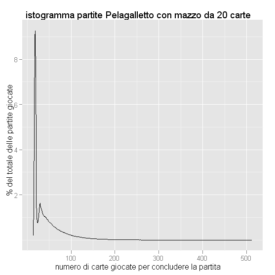
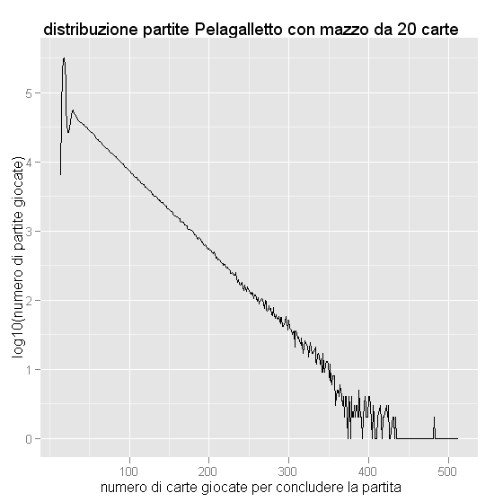
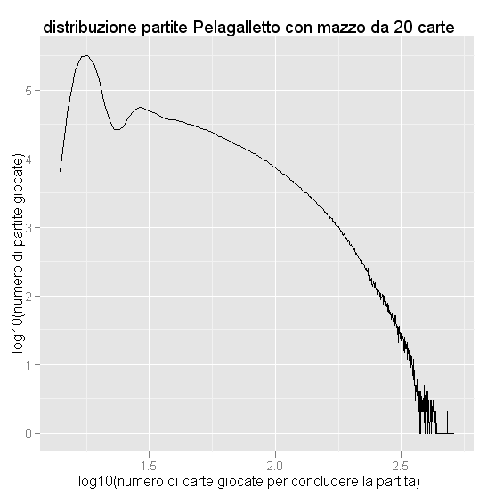

# Is there a non-terminating game of Beggar-My-Neighbour?

**YES, since March 19, 2024!** See https://doi.org/10.48550/arXiv.2403.13855 *A Non-Terminating Game of Beggar-My-Neighbor* by 
Brayden Casella, Philip M. Anderson, Michael Kleber, Richard P. Mann, Reed Nessler, William Rucklidge, Samuel G. Williams, Nicolas Wu.
The non-terminating game is:
```
1: ---K---Q-KQAJ-----AAJ--J-- 
2: ----------Q----KQ-J-----KA
```
## Pre 2024
Pelagaletto is an Italian game similar to Beggar-My-Neighbour. At present date, March 2023, *Is there a non-terminating game of Beggar-My-Neighbour?* is still an open question (with the last record beeing Reed Nessler (09-06-2022). 1164 tricks, 8344 cards: `1: ---AJ--Q---------QAKQJJ-QK 2: -----A----KJ-K--------A---`) while for the Italian game Pelagaletto the question was finally answered by Riccardo Zanotto in February 2017:

``` 
00302020303100000310-00100200002000000010
```

see https://github.com/drago-96/cavacamisa and https://github.com/drago-96/cavacamisa/blob/master/infinite/20170217.txt.


Furthermore, Diego Mazzaro wrote:

> Some friends and I found this back in May 2016. At the time we were beaten by just some days by Michele Cocco Lasta who found the first cycle before us. He didn't whant to publish the configutation for "not taking away the pleasure of search to other people". He just published a one line note on a facebook page he had named "Cavacamisa Straccia camicia Pelagalletto Infinita".
>
> Recently I was noticed that on other sites someone found the configurations believing to be the first one. Maybe someone found it before 2016 too.
>
> Since then I moved to try tackling Beggar My Neighbour building a distributed computing network (with few PC actually) and looking for math reasonings that can help to reduce the search space.
>
> Answer
>
> The following are some of the existing starting sequences that generates non terminating games. All of these are related to three distinct cycles.
>
> Only Cycle 3 has balanced configurations in it (with 20/20 cards) while Cycle 1 and Cycle 2 can be reached from the given starting configurations but do not contain balanced configurations directly.
>
> The search was not exaustive so I cannot say if there are other cycles on Cavacamicia.

``` 
Cycle 1 - 18 rounds, 93 tricks
00200000021000013000 | 00020001020310030300
00002000102031003030 | 00200000021000013000
00001000320020010001 | 32020000000010030003
02001000121003000200 | 01003000303000020000
00100300030300002000 | 02001000121003000200
01000100300020001020 | 03303000020000002100
00330300002000000210 | 01000100300020001020

Cycle 2 - 10 rounds, 78 tricks
00000030100202020310 | 00010000300002100300
00001000030000210030 | 00000030100202020310
10020202031000030030 | 00002100300000000010
10000021003000000000 | 01002020203100003003
13000021003000000000 | 00100202020310000300
00001002020203100003 | 10300002100300000000
01030000210030000000 | 00001002020203100003
00003010020202031000 | 00100030000210030000
00010003000021003000 | 00003010020202031000
02020203100003003010 | 00210030000000001000
00021003000000000100 | 02020203100003003010

Cycle 3 - 44 rounds, 273 tricks
00020000000100000310 | 02031000003100302020
00203100000310030202 | 00020000000100000310
00000010020302030310 | 00100300010020000200
00010030001002000020 | 00000010020302030310
00203020303100000310 | 00100200002000000010
00020000000100000210 | 03031000003100302020
00303100000310030202 | 00020000000100000210
00000010030202030310 | 00100300010020000200 
00010030001002000020 | 00000010030202030310 
00302020303100000310 | 00100200002000000010
00010020000200000001 | 00302020303100000310
00000010030302020310 | 00100300010020000200
00010030001002000020 | 00000010030302020310
00303020203100000310 | 00100200002000000010
00010020000200000001 | 00303020203100000310
```

See *Diego Mazzaro (https://cstheory.stackexchange.com/users/68620/diego-mazzaro), Does this game terminate?, URL (version: 2023-03-06): https://cstheory.stackexchange.com/q/52560*.

See also https://zxq.co/howl/chevainpataia by morgan.


-----

Pelagaletto card game simulator. 

The original code that was at https://code.google.com/p/pelagaletto/ now is at https://github.com/alessandro-gentilini/pelagaletto

For a bibliography see in this repository [A bibliography for the problem of non-terminating game of Beggar-My-Neighbour](bibliography_for_non-terminating_game_of_Beggar-My-Neighbour.pdf?raw=true).

I used to keep updated a popular scientific introduction (in Italian) at https://sites.google.com/site/alessandrogentilini/pelagalletto-infinito-beggar-my-neighbour but now that link is broken and so I put here that content.

# Pelagalletto infinito (Beggar-My-Neighbour)

Il Pelagalletto (anche Pelagaletto o in dialetto romagnolo Pelagalett) è un gioco di carte giocato in Romagna con un mazzo di 40 carte, tipiche le [Romagnole Dal Negro](https://shop.dalnegro.com/prodotto/romagnole-pro/).

Il gioco è giocato anche in altre parti d'Italia dove è conosciuto con nomi diversi: [Camicia](http://www.base5forum.it/viewtopic.php?f=1&t=881), [Cavacamicia](http://www.base5forum.it/viewtopic.php?f=1&t=881), [Cavacamisa](https://groups.google.com/g/it.hobby.enigmi/c/86auIjeRGFo?pli=1), Cavacamixa, Pataiola, [Pataja](https://www.wherevent.com/detail/ducato-di-parma-feriae-matricularum-parmae-1969-43), Pelagallina, Resta in camicia, [Scippacuore](http://www.base5forum.it/viewtopic.php?f=1&t=881), Stracciacamicia, Straccia in camicia.

Nel caso di due giocatori il mazzo si divide in due mazzetti uguali e la partita procede secondo le regole fino a che uno dei due giocatori conquista tutte le carte dell'avversario e vince. Per vincere non sono applicabili strategie perché l'esito della partita dipende solamente dalla configurazione iniziale del mazzo.

Alle volte la partita dura più del solito e ci si domanda se possa esistere una partita senza fine, interminabile: il Pelagalletto infinito, o, in inglese "Is there a non-terminating game of Beggar-My-Neighbour?".

Le regole del gioco sono simili a quelle del gioco noto in inglese come [Beggar-My-Neighbour](https://en.wikipedia.org/wiki/Beggar-my-neighbour), che è però con un mazzo da 52 carte da Ramino, e sono qui riportate come presenti nella voce [Straccia Camicia](https://it.wikipedia.org/wiki/Straccia_camicia) di Wikipedia.

> Ogni giocatore impugna il proprio mazzetto, così come l'ha ricevuto e senza guardarne il contenuto. Le uniche carte vincenti sono l'asso, il due e il tre di qualsiasi seme. Il primo giocatore pone la prima carta del proprio mazzetto sul tavolo in modo visibile. A turno fanno lo stesso gli altri giocatori, così da formare un mazzetto comune al centro del tavolo. Quando un giocatore gioca una delle tre carte vincenti il giocatore successivo è obbligato a giocare il numero di carte indicate (1 per l'asso, 2 per il due e tre per il tre). Se durante queste giocata esce una delle carte vincenti l'obbligo si interrompe e tocca al giocatore successivo giocare il numero di carte indicate. Se il giocatore obbligato a giocare le carte non pone una carta vincente il mazzetto di carte presente sul tavolo viene vinto dal giocatore che ha giocato l'ultima carta vincente. Questo riporrà le carte sotto alle proprie e inizierà una nuova giocata.

## Letteratura esistente

La questione del Pelagalletto infinito è trattata da Marc M. Paulhus nell'articolo ["Beggar My Neighbour"](http://www.maa.org/pubs/monthly_feb99.html) pubblicato sulla rivista The American Mathematical Monthly Vol. 106, No. 2 (Feb., 1999), pp. 162-165; a pagina 164 l'autore scrive che:

> For the record, the Italian game of "Camicia" is played with a 40 card deck with 12 court cards (4 each of values 1, 2, and 3). Playing a billion random deals of Camicia also failed to produce any cycles.

e quindi non ha trovato il Pelagaletto Infinito in un miliardo di partite casuali.

Nel 2009 il matematico [Richard K. Guy](http://math.ucalgary.ca/profiles/richard-guy) lo indica come problema non risolto in ["Unsolved problems in Combinatorial Games"](http://www.msri.org/communications/books/Book56/files/61guy.pdf) contenuto nel libro MSRI Publications – Volume 56 "Games of No Chance 3", Edited by Michael H. Albert and Richard J. Nowakowski - Cambridge University Press, Cambridge, 2009.

[Richard P. Mann](http://richardpmann.weebly.com/beggar-my-neighbour-records.html) ha detenuto fino al primo maggio 2012 il record della più lunga partita a Beggar My Neighbour: 7157 carte giocate per concludere la partita. Mann dà anche la configurazione iniziale che porta alla sua partita:
```
1: K-KK----K-A-----JAA--Q--J- 
2: ---Q---Q-J-----J------AQ--
```

Al 4 maggio 2012 il record era detenuto da Reed Nessler (University of Virginia) che lo mostra nella sua pagina "Reed Nessler's draft zebu": 7224 carte giocate per concludere la partita. La configurazione iniziale è:
```
1: -J-------Q------A--A--QKK-  
2: -A-Q--J--J---Q--AJ-K---K--
```

Al 15 giugno 2014 il record appartiene a William Rucklidge con 7960 carte giocate per concludere la partita ed è così registrato nella pagina che Richard P. Mann sembra tenere aggiornata con i nuovi record (non è chiaro se il record sia del 5 marzo del 2014 oppure del 3 maggio del 2014):
```
1: -J------Q------AAA-----QQ- 
2: K----JA-----------KQ-K-JJK
```

Michael Z. Spivey nell'articolo "Cycles in war" riporta che:

> Berlekamp, Conway, and Guy also report in Vol. 4 of Winning Ways for Your Mathematical Plays [2, p. 892] that Marc Paulhus has shown that the similar game of Beggar-My-Neighbor can cycle, although the cycles are rare: About 1 in 150,000 games played with the usual 52-card deck cycle.

e quindi esisterebbero molte partite infinite di Beggar My Neighbour, purtroppo però Spivey non riporta nessuna configurazione che porti alla partita infinita ma d'altra parte l'ambito del suo articolo è un altro e la citazione che fa è solo nell'introduzione. Non sono riuscito a consultare il volume 4 di "Winning ways for your mathematical plays" e quindi non so se riporti le configurazioni che originano le partite infinite.

Il problema viene quindi definito come risolto ma finché non è resa pubblica una dimostrazione o almeno una configurazione iniziale che dà la partita infinita si tratta solo di una congettura e non di un fatto.

Nel 2011 A. Aleksenko (Алена Алексенко) e E. Lakshtanov (Е.Лакштанов) pre-pubblicano l'articolo "Finiteness of the playing time in 'Beggar-my-neighbour' card game" - Конечность продолжительности карточной игры «Разори моего соседа» dove sostengono che:

> It is proved that in card games similar to 'Beggar-my-neighbour' the mathematical expectation of the playing time is finite, provided that the player who starts the round is determined randomly and the deck is shuffled when the trick is added. The result holds for the generic setting of the game. http://arxiv.org/abs/1109.1460

Una mia traduzione letterale del riassunto qui sopra:

> Abbiamo provato che nei giochi di carte simili a 'Beggar-my-neighbour' la speranza matematica del tempo di gioco è finita, assumendo che il giocatore che inizia il round sia scelto casualmente ed il mazzo sia mischiato quando si aggiunge il trick. Il risultato è valido per il gioco in generale.

L'articolo è scritto in russo ed io non conosco il russo, quindi posso solamente dare una mia interpretazione del riassunto: se si considera il tempo dopo cui termina il gioco come una variabile aleatoria allora la "speranza matematica del tempo di gioco" è il valor medio di questo tempo ed il fatto che sia finito indica che non esisterebbe la partita infinita. 

Sono però necessari due requisiti affinchè si ottenga il risultato.

Ipotizzo che il "round" sia quella parte del gioco che inizia dopo che uno dei giocatori ha vinto il mazzetto di carte. Ipotizzo anche che il "trick" sia il mazzetto di carte vinto. I due requisiti sono che chi debba iniziare il round sia scelto a caso (e non invece che spetti ad iniziare a chi ha vinto il mazzetto) e che dopo aver aggiunto il mazzetto al proprio mazzo lo si debba mischiare. Nessuno di queste due regole era presente nel pelagaletto che ho sempre giocato e non sembrano essere presenti neppure nelle regole indicate da wikipedia.

Se Aleksenko e Lakshtanov hanno dato una dimostrazione matematica valida allora, con i loro requisiti, non esiste la partita infinita. L'articolo è pubblicato in inglese dalla rivista Problems of Information Transmission: LAKSHTANOV, Evgenii Leonidovich; ALEKSENKO, Alena Il'inichna. Finiteness in the Beggar-My-Neighbor card game. Problems of Information Transmission, 2013, 49.2: 163-166.

## Simulazioni al computer

Un mazzo di 40 carte può essere mescolato in 40! modi diversi, per il Pelagalletto si tratta quindi di 815915283247897734345611269596115894272000000000 partite diverse oppure, considerando l'ordine di grandezza, di 8 x 10<sup>47</sup> partite diverse.

Il numero di partite è un numero finito, un computer opportunamente programmato potrebbe tentare una partita alla volta alla ricerca di una partita infinita; questo è fattibile in teoria ma difficilmente realizzabile in pratica: se ogni persona al mondo (6.79 miliardi) avesse un computer ed ogni partita fosse classificata dal computer come finita/infinita in un millesimo di secondo, occorrerebbero, nel caso peggiore che ci sia solo una partita infinita e che sia proprio l'ultima che si controlla, comunque più di 10<sup>27</sup> anni per concludere l'indagine (il nostro universo esiste solamente da poco più di 13 x 10<sup>9</sup> anni).

L'approccio descritto qui sopra è il cosiddetto approccio "forza bruta" perché non viene fatto nessuno sforzo per comprendere bene il problema e cercare di semplificarlo; la semplificazione richiede fatica ed in genere non ci sono regole che consentano la semplificazione automatica. Spesso la semplificazione avviene per passi successi.

Per esempio un primo passo può tenere conto del fatto che non è necessario esaminare tutte le diverse partite: siccome ci sono solamente tre carte che inducono la "battaglia", le configurazioni che differiscono per carte diverse dall'asso, dal due e dal tre, saranno equivalenti e daranno luogo alla stessa partita. 

Il mazzo di quaranta carte può essere semplificato, ai fini della simulazione, in un mazzo che ha quattro assi, quattro 2, quattro 3 e le restanti ventotto carte tutte uguali ad una carta bianca (rappresentate dai trattini nella configurazione di Mann citata sopra). 
Le possibili combinazioni di questo mazzo semplificate sono date dal coefficiente multinomiale `40!/(4!*4!*4!*28!)` che vale 193584473082000. Il coefficiente multinomiale dà il numero di permutazioni di un multiinsieme: 40 sono le carte del mazzo completo; poi ci sono 4 carte che sono uguali ai fini del gioco (i quattro assi), altre 4 carte uguali (i quattro due), altre 4 carte uguali (i quattro tre) per un totale di 4x3=12 carte che inducono la "battaglia"; restano poi 40-12=28 carte che non producono la battaglia (per il coefficiente multinomiale vedi Donald E. Knuth, "The art of computer programming", Volume 3, formula(3), capitolo 5.1.2 Permutations of a Multiset, pagina 23).
Nelle condizioni ipotetiche descritte prima (un computer per ogni persona al mondo, un millesimo di secondo per valutare la finitezza di una partita) occorrerebbero quindi poco più di 28 secondi, mentre se lo dovessi fare solo con il mio computer, supponendo di non aggiornarlo mai, impiegherei comunque più di 6mila anni. Il 22 gennaio 2014 William Rucklidge, un dipendendente di Google, annuncia in un suo post di aver raggiunto il record ed in merito al numero di computer usati scrive:

> Well, even with today's fast computers (and a whole lot of them - access to a whole lot of computers is one of the useful things about working at Google), it would take an unreasonably long time to play all possible games of BMN, but maybe I'd get lucky and find an infinite game (if any exist) quickly. Or maybe I'd find a new "longest known" game and set a record - which I've done.

che traduco in:

> Bene, anche con i computer veloci del giorno d'oggi (e dico molti computer - l'accesso a molti computer è una di quelle cose utili che si hanno lavorando per Google) ci vorrebbe un tempo irragionevolmente lungo per giocare tutte le possibili partite di BMN (Beggar-My-Neighbor), ma forse sarò fortunato e troverò velocemente la partita infinita (nel caso che esista). Oppure forse troverò la più lunga partita ad oggi conosciuta ed avrò il record - cosa che ho effetivamente fatto.

A questo primo passo ne possono seguire altri che mi aspetto siano via via più complicati e faticosi da capire.

Quello indicato qui è solamente un primo semplice trattamento del problema, probabilmente ce ne sono altri che riducono ulteriormente il tempo necessario a simulare tutte le partite o a giungere in maniera più furba alla soluzione matematica del problema cioè ad una dimostrazione. Il già citato Marc M. Paulhus non aveva probabilmente trovato questo metodo perché provò "solamente" un miliardo di partite. 

La partita a Pelagaletto può essere trattata come una successione di "stati", ogni stato è descritto da un insieme di informazioni come per esempio "è in corso una battaglia?", "quale giocatore deve calare la carta?", "quali carte ci sono sul tavolo", "quali carte ha il giocatore A?", "quali carte ha il giocatore B?", eccetera.

Per simulare una partita si parte dallo stato "non ci sono battaglie, A deve calare la carta, non ci sono carte sul tavolo, A ha metà delle carte del mazzo, B ha l'altra metà" e poi si passa via via agli stati successivi. La partita infinita si riconosce perché ad un certo punto ci si troverà in uno stato da cui si era già passati precedentemente durante la stessa partita.

Simulando tutte le partite giocabili con metà mazzo, quindi con solo 20 carte, ho trovato 16 partite infinite:

```
 246414   00000030100100302020
 477920   00001002000030302010
 670912   00003010001030202000
 917330   00020100301200000003
1120477   00100000003020100302
1199338   00100302020000003010
1257979   00120000003002010030
1397712   00201003021000000003
1613646   00303020100001002000
1849144   01030202000000301000
2568257   10003030200000010020
2597170   10020200000301000003
2779940   13020200000030100000
3305725   30020100300120000000
3330878   30100000300202000010
3371832   30201003020100000000
```

Il primo numero è l'indice della partita (la partita 0 è quella che inizia con il mazzo 00000000000000112233), la seconda stringa è il mazzo con il quale si inizia la partita (le prime dieci carte sono del giocatore A, le ultime dieci carte sono del giocatore B). Per controllare il mio programma ho simulato le partite di Mann e di Nessler ed ho ottenuto gli stessi loro risultati per quanto riguarda il numero di carte giocate ed il numero di battaglie ingaggiate.

Le figure seguenti mostrano la distribuzione delle durate di tutte le partite (escluse le 16 che non terminano), in particolare il picco corrisponde a quasi il 10% delle partite (323481) che si concludono dopo aver giocate 18 carte.







La presenza di partite infinite nel caso di mezzo mazzo implica che ci saranno partite infinite con il mazzo completo?

Non so rispondere alla domanda, la caccia è ancora aperta.

## Note sull'algoritmo usato

Ho scritto un programma in C++ per simulare le partite.

Le partite sono enumerate con `std::next_permutation`.

Ci sono due parti fondamentali dell'algoritmo, la prima è il simulatore di partita, la seconda è il riconoscimento di una partita infinita. 

Ho provato modi differenti di tenere lo stato: nel primo modo lo stato è una `std::string` e tutti gli stati di una partita sono tenuti in una (ordered) `std::map`, tenere lo stato come string è semplice ma consuma più memoria del necessario, tenere gli stati in una map è semplice ma consuma più tempo del necessario perché non è importante che gli stati siano tenuti in ordine alfabetico.

Nel secondo modo lo stato è un `std::bitset` e tutti gli stati di una partita sono tenuti ancora in una map. Tenere lo stato come bitset permette di ridurre al minimo la sua occupazione di memoria, per usare la map è però necessario scrivere l'operatore di ordinamento per il bitset; la map consuma comunque ancora più tempo del necessario perché non è importante tenere gli stati in ordine.

Nel terzo modo lo stato è un bitset e tutti gli stati di una partita sono tenuti in una `std::unordered_map`, per usare l'unordered_map si deve scrivere<sup>1</sup> la funzione di hash per il bitset ma a questo punto si ha il minimo impiego di memoria ed il minimo impiego di tempo.

Il codice non è ottimizzato (se non per le ottimizzazioni standard fatte dal compilatore nella configurazione "Release"), è single-threaded, e per giocare le quasi 3 milioni e mezzo di partite (3488400) possibili con il mezzo mazzo ci sono voluti circa 10 minuti su un vecchio Intel Pentium 4 a 3GHz con 1GB di RAM e Windows XP SP3.

<sup>1</sup><sub>preciso: io ho dovuto scriverla perché usando Microsoft Visual C++ 2010 Express l'impiego della funzione di hash della libreria standard dava un warning, il warning non è più presente nella RC di Visual Studio 2012.</sub>

<sub>
© Alessandro Gentilini 2010 03 ottobre 2010.

Qualche aggiunta il 02 febbraio 2012.

Aggiornamento il 14 aprile 2012.

Aggiornamento 9 giugno 2012.

Il 21 luglio 2012 aggiunte informazioni sulle partite infinite presenti nel mezzo mazzo.

Il 15 giugno 2014 aggiunte informazioni sul record attualmente detenuto dal googler William Rucklidge; aggiunto link a github per il codice C++ e per una bibliografia in pdf.
</sub>


